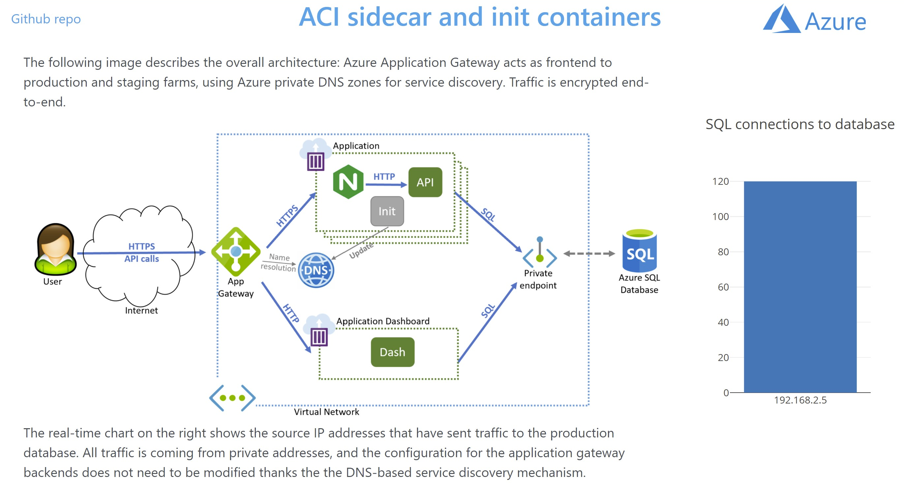
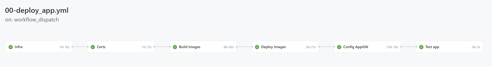

# ACI in VNet with Sidecar Containers

Sidecar containers are a common pattern used by containerized workloads where different functionalities are implemented in separate containers in the samem pod or container group. If you want to know more about sidecars you can visit [Modernize web apps using Sidecar patterns](https://mslabs.cloudguides.com/guides/Modernize%20existing%20web%20apps%20with%20new%20capabilities%20using%20Sidecar%20patterns). The sidecar pattern can be implemented in Kubernetes, but also in Azure Container Instances. This repo is showing some advanced features of Azure Container Instances including sidecars:

- Advanced scheduling of ACIs including:
    - Init containers
    - Sidecars
    - Deployment in Virtual Networks
    - YAML-based deployments
- Getting certificates from [LetsEncrypt](https://letsencrypt.org/) into Azure Key Vault
- Accessing Azure PaaS services via private endpoints
- End-to-end SSL with Azure Application Gateway

Following is a screenshot of the dashboard, part of this repository, showing the overall application architecture:

Sample deployment [scripts](./scripts/) are included, as well as Github workflows that can be run individually or in a group:

## Workflow details

There are 6 steps in the [00-deploy_app.yml](.github/workflows/00-deploy_app.yml) workflow, that you can opt to run individually with these additional workflows:

- [01-infra_setup.yml](.github/workflows/01-infra_setup.yml): creates a resource group and certain assets that will be leveraged in further workflows:
    - Azure Container Registry
    - Azure Key Vault
    - Azure Application Gateway
- [02-build_images.yml](.github/workflows/02-build_images.yml): builds the images for the applications in this project and pushes them to the Azure Container Registry created in the previous step. The applications built are:
    - [api](./api/)
    - [web](./web/)
    - [dash](./dash/)
- [03-gen_cert.yml](.github/workflows/03-gen_cert.yml): [LetsEncrypt](https://letsencrypt.org/) certificates will be generated for the domain specified in the environment variables. The certificate will be stored in the Azure Key Vault.
- [04-deploy_images.yml](.github/workflows/04-deploy_images.yml): the images build in step 2 will be configured will the certificates generated in step 3 and will be deployed to the Virtual Network using YAML.
- [05-config_appgw.yml](.github/workflows/05-config_appgw.yml): the Azure Application Gateway will be configured to send traffic to the deployed Azure Container Instances
- [06-test_app.yml](.github/workflows/06-test_app.yml): a very simple script will initialize the database and send some traffic so that the dashboard's real time chart reflects some data

All of the workflows above use primarily the Azure CLI to provision and configure all the elements in this architecture.

## Getting Started

### Prerequisites

- Valid Azure subscription with the possibility of creating Service Principal and role assignments.
- Public DNS zone in Azure, required to validate [LetsEncrypt](https://letsencrypt.org/) certificates.

### Quickstart

1. Fork this repository.
2. Create a Github secret with access to your subscription, called `AZURE_CREDENTIALS`.
3. Modify the environment variables in the workflow [00-deploy_app.yml](.github/workflows/00-deploy_app.yml).
4. Run the workflow [00-deploy_app.yml](.github/workflows/00-deploy_app.yml).
